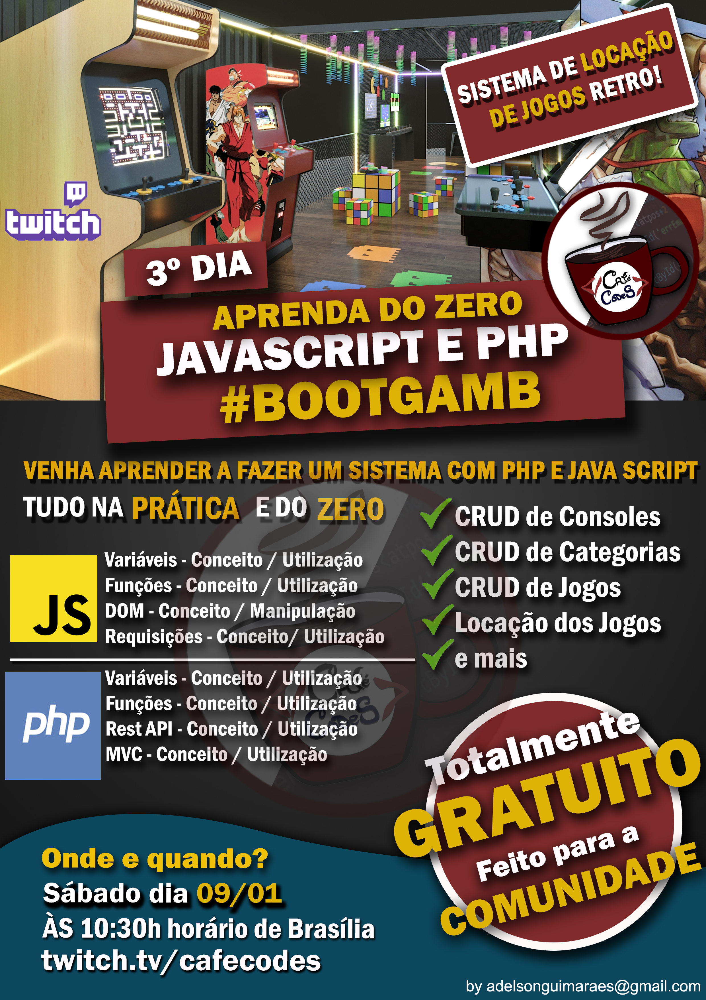

# Sistema de Locadora Retro
 - descrição: Este é um projeto realizado em live no meu canal da Twitch [twitch.tv/cafecodes](https://www.twitch.tv/cafecodes), em um evento chamado #BootGamb.
 - Detalhes: O projeto se resume na construção de um pequeno sistema que de gerenciamento para uma locadora de jogos retro.
 - Objetivo: O objetivo é ensinar para o público, partindo do zero conceitos e práticas sobre JavaScript e PHP.
 - Público Alvo: O público alvo são pessoas com interesse em iniciar, aprender, aperfeiçoar ou entender como funcionam os sistemas, com foco em desenvolvimento WEB.
 - Status: Em desenvolvimento;

# Requisitos
- [VS CODE](https://code.visualstudio.com/download) 
- [XAMPP](https://www.apachefriends.org/pt_br/download.html)
- [REPOSITORIO](https://github.com/adelsonguimaraes/locadora)

# Checklist
1. Conceito de Variáveis JS/PHP [X]
2. Conceito de Funções JS/PHP [X]
3. Conceito de Manipulação JS [X]
4. Conceito de Requisições JS [X]
5. Conceito de Rest API PHP [X]
6. Conceito de MVC [X]
7. Construção de Tela do Console [X]
8. Construção de Controller do Console [X]
9. Construção de Rest API do Console [X]
10. Construção de DAO do Console [X]
11. Criação do Método Listar do Console [X]
12. Criação do Método Cadastrar do Console [X]
13. Criação do Método Atualizar do Console [X]
14. Criação do Método Deletar do Console [X]
 
# Considerações
Desejo a todos que estiverem acompanhando esse projeto que seu aprendizado seja grandioso, e que eu consiga repassar conhecimentos importantes que realmente façam diferença na sua vida. 
Abraços!

# Banner do Evento
